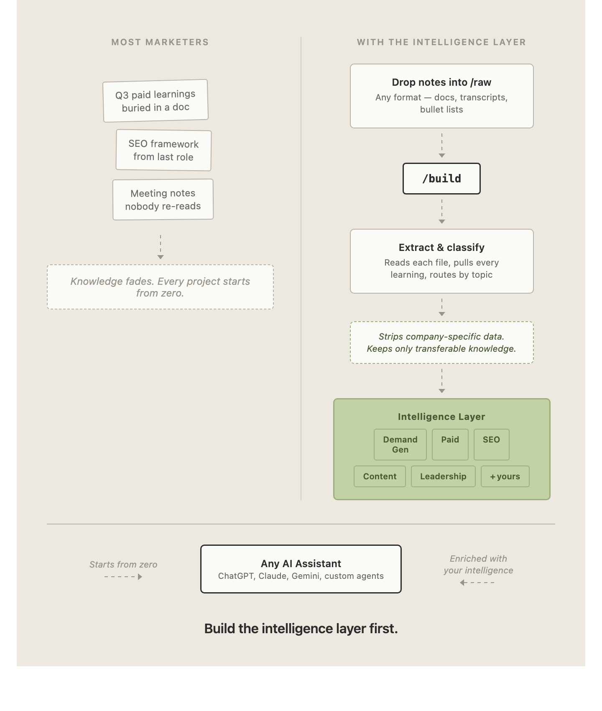

# Your Marketing Intelligence Layer

Every marketer has years of hard-won knowledge scattered across old decks, meeting notes, Slack threads and their own head. This turns that pile into a single, searchable intelligence layer you actually use — and that your AI assistants can read.

You drop raw notes into a folder. You run one command. You get a browsable HTML page of everything you've learned, organised by topic and by the companies you've worked at.



---

## What you need

1. **[Claude Code](https://claude.com/claude-code)** — Anthropic's coding agent. It runs in your terminal. You don't need to know how to code to use it.
2. **A Claude subscription** (Pro or Max) or an API key.
3. **This repo**, downloaded to your computer.

That's it. No database, no server, no hosting.

---

## Setup (5 minutes)

### 1. Install Claude Code

Open your Terminal (Mac: press `Cmd + Space`, type "Terminal", hit Enter) and paste:

```
npm install -g @anthropic-ai/claude-code
```

If that errors because you don't have Node installed, follow the [official install guide](https://docs.claude.com/en/docs/claude-code/setup) first.

### 2. Get this repo onto your computer

Either click the green **Code → Download ZIP** button at the top of this page and unzip it, or paste this into Terminal:

```
git clone https://github.com/searchbrat/marketing-intelligence-layer.git
```

### 3. Open the folder in Claude Code

```
cd marketing-intelligence-layer
claude
```

### 4. Add your notes

Put anything into the `raw/` folder — meeting notes, old strategy docs, exported Google Docs, voice memo transcripts, half-finished markdown files, a text file of bullet points you typed at 11pm. Messy is fine. That's the point.

There's an example file already in there so you can see it work before you add your own.

### 5. Run it

Inside Claude Code, type:

```
/build
```

The first time, it asks for your name, your role, and any custom topics you want beyond the eight defaults. Then it reads your notes, shows you every learning it found and where it plans to file it, and **waits for you to approve** before writing anything.

When it's done, open `index.html` in your browser.

---

## Using it day to day

| Command | What it does |
|---|---|
| `/build` | Process new notes from the local `raw/` folder |
| `/build drive` | Process new notes from a Google Drive folder instead |
| `/build setup` | Change your name, role, or topics |

Drop new notes into `raw/` whenever you have them and run `/build` again. It only reads files it hasn't seen before, adds the new learnings into your existing page, and moves the processed files to `archive/`.

Your intelligence layer grows every time you run it.

## Session-analysis proof of concept

This branch also contains a local, private proof of concept for turning Codex
and Claude Code sessions into proposed marketing learnings. It keeps source
census, redaction, provenance, and exact-deduplication controls, then puts every
machine-qualified proposal through an offline human-review page. Only accepted
or human-edited proposals can enter the generated intelligence layer.

See [`docs/session-poc-runbook.md`](docs/session-poc-runbook.md) for the review
and publication commands. The full-corpus continuation keeps the historical U7
diagnostic intact, calibrates on reviewed decisions, classifies every dependence
group, extracts one representative packet from each selected group, records
the actual provider separately from the source harness, and stops at a fresh
human-review queue. Publications retain their named reviewer. A model-reviewed
publication can be returned to a fresh pending queue before it enters the
human-authoritative intelligence layer.

---

## What's in this repo

```
.claude/commands/build.md   The /build skill — the brain of the whole thing
template-index.html         The blank intelligence layer template
raw/                        Drop your notes here
archive/                    Processed notes get moved here automatically
index.html                  Your intelligence layer (created on first run)
config.json                 Your name, role, topics (created on first run)
```

## The eight default topics

Demand Generation · Paid Advertising · SEO · Content Marketing · Attribution & Measurement · Product Marketing · Activation & Onboarding · Leadership & Strategy

Add your own — "AI in Marketing", "Brand", "Partnerships", "Community" — during setup or later with `/build setup`.

---

## A note on confidentiality

The skill is built to capture *transferable* knowledge, not company secrets. It deliberately skips exact revenue figures, internal targets, unreleased product names, customer lists and individual employee names, and generalises anything close to the line. What it keeps is the frameworks, the results, the calls you made and what you'd do differently.

Read `.claude/commands/build.md` if you want to see exactly what it does — it's plain English, and you can edit any of it.

---

## Make it yours

The whole system is two files. Change them.

- Want different topics or a different routing logic? Edit `.claude/commands/build.md`.
- Want a different look? Edit `template-index.html`.
- Want it to capture something other than marketing — product, sales, engineering? Rewrite the topic table in the skill. Nothing else needs to change.

---

Built by [Kieran Flanagan](https://kieranflanagan.substack.com). Free to use, fork and modify.
