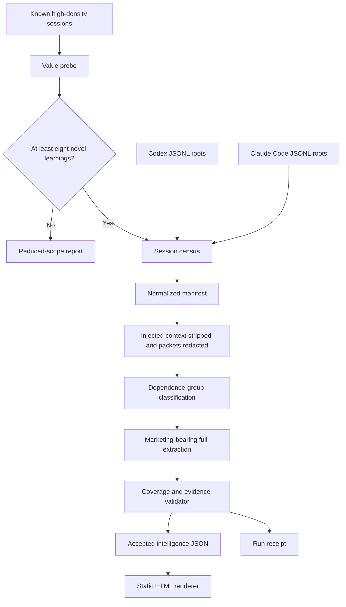
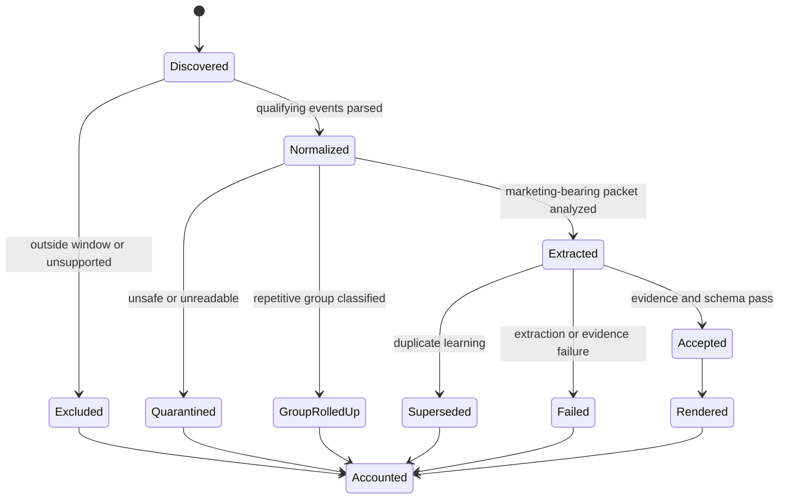
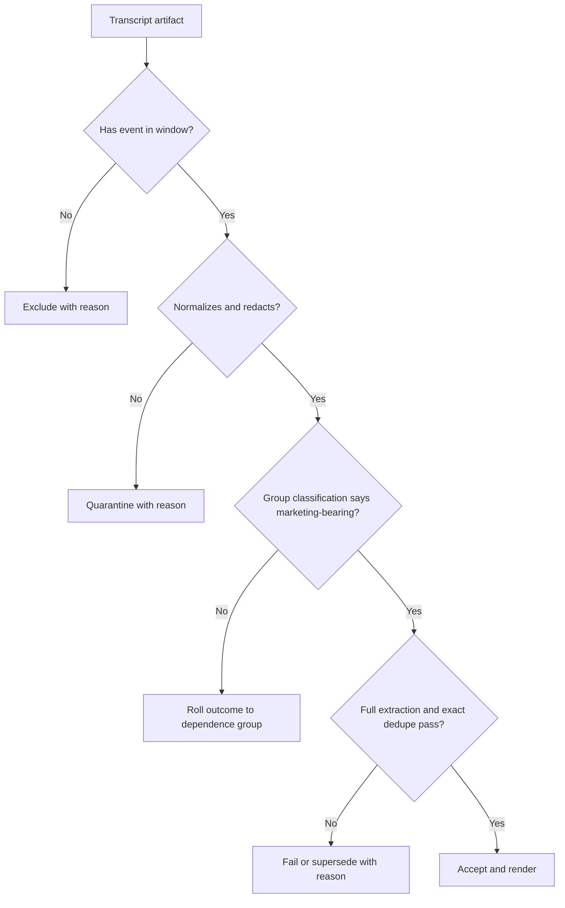

# Marketing session intelligence proof of concept - Plan

## Goal Capsule

- **Objective:** [DATA] Extend the upstream Marketing Intelligence Layer into a local proof of concept that analyzes every Codex and Claude Code transcript artifact active from August 17, 2026, at 12:00 AM AMT through August 24, 2026, at 6:57:36 PM AMT.
- **Authority:** [DATA] The confirmed session scope and privacy boundary govern the proof of concept. `README.md`, `.claude/commands/build.md`, and `template-index.html` govern the upstream interaction and presentation patterns where they do not conflict with that scope.
- **Execution profile:** [LOGIC] Prove that a small high-density sample yields novel marketing intelligence before building the deterministic read-only census, ingestion, and validation pipeline. Keep generated intelligence and intermediate transcript material local and ignored by Git.
- **Stop conditions:** [LOGIC] End as delivered with reduced scope if the value probe yields fewer than eight novel, actionable marketing learnings or exceeds its resource envelope. Stop as blocked if the definitive census cannot account for every in-window transcript artifact, if unredacted sensitive content reaches a generated artifact, or if a displayed load-bearing claim lacks a resolvable evidence pointer.
- **Tail ownership:** [LOGIC] The implementing agent owns the baseline proof-of-concept run, the coverage report, the rendered local artifact, and cleanup of abandoned implementation attempts.

---

## Product Contract

### Summary

[DATA] The upstream repository turns raw notes into a local static marketing-intelligence page through a Claude `/build` command.
[DATA] This proof of concept adds Codex and Claude Code sessions as a first-class input while preserving the upstream local, static, and AI-readable outcome.
[LOGIC] The product first tests whether the best-looking session strata contain enough novel intelligence to justify the full pipeline. A passing probe leads to complete census coverage and tiered analysis of the fixed window.

### Problem Frame

[DATA] The current repository has one prompt-driven build command, one static HTML template, and raw/archive folders.
[DATA] It has no deterministic transcript census, normalized schema, automated tests, evidence ledger, secret scanner, or distinction between interactive sessions and automated software development kit (SDK) runs.
[DATA] The preliminary local census found 339 active transcript artifacts representing 336 harness session IDs and about 261 MB of source data.
[DATA] The Claude subset is heavily skewed: 123 classifier-test artifacts account for about 16.7 MB, 72 filesystem-root SDK artifacts account for about 11.1 MB, and only three root marketing-project artifacts account for about 2.3 MB.
[DATA] Shared startup context is serialized inside most fixed-window artifacts: 236 of 245 Claude artifacts contain the shared LAW block, and 92 of 94 Codex artifacts contain the injected memory-summary marker.
[LOGIC] Feeding those files directly into the existing `/build` flow would make coverage unverifiable, duplicate child-agent work, treat injected context as independent corroboration, spend model capacity on repetition, and risk copying sensitive transcript content into a new artifact.

### Actors

- A1. [DATA] Heikki reviews and uses the local intelligence page.
- A2. [LOGIC] The deterministic pipeline discovers, normalizes, redacts, validates, and renders local artifacts.
- A3. [LOGIC] A Codex or Claude analysis seat interprets safe evidence packets and proposes learnings.
- A4. [LOGIC] A future implementing agent consumes the plan and the same evidence contracts without access to hidden conversational context.

### Requirements

**Corpus and provenance**

- R1. [DATA] Include every locally retained transcript artifact under the configured authoritative roots with at least one event timestamp from August 17, 2026, at 12:00 AM AMT through the fixed proof-of-concept cutoff.
- R2. [LOGIC] Record artifact, packet, and candidate states with the canonical terminal vocabularies and roll-up rules in KTD6.
- R3. [LOGIC] Preserve harness session ID, artifact ID, parent-child relationship, source kind, entry point, working-directory category, first and last in-window timestamps, event count, and a canonical in-window content hash.
- R4. [LOGIC] Treat event timestamps as inclusion authority. Use modification time only as an optimization that cannot exclude a qualifying artifact.
- R5. [LOGIC] Keep root conversations, child-agent transcripts, interactive sessions, SDK runs, and synthetic/test workloads distinct in the normalized data.

**Safety and evidence**

- R6. [DATA] Read source transcripts without moving, editing, archiving, or otherwise mutating them.
- R7. [DATA] Keep raw transcripts local and store only normalized metadata, resolvable evidence pointers, and redacted extracts in generated intelligence artifacts.
- R8. [LOGIC] Prevent known credential shapes, sensitive personal data, proprietary identifiers, unsafe raw markup, and unapproved model egress from reaching an analysis seat or rendered HTML.
- R9. [LOGIC] Label each load-bearing learning `[DATA]`, `[LOGIC]`, or `[HYPOTHESIS]` and require `[DATA]` items to resolve to one or more source events.
- R10. [LOGIC] Do not treat repeated SDK/test prompts, duplicated artifacts, or child-agent agreement as independent corroboration.
- R24. [LOGIC] Fingerprint and remove known injected instruction, memory, policy, and startup-hook blocks regardless of their serialized role before packet write. Preserve only their hashes, provenance, and exclusion counts.

**Analysis and intelligence**

- R11. [DATA] Account for the complete in-window corpus while tiering model work: classify every distinct dependence group, fully extract marketing-bearing groups and selected mixed-work artifacts, and roll a representative group outcome to repetitive members.
- R12. [LOGIC] Route transferable findings into the eight upstream marketing topics plus a custom `AI and marketing operations` topic.
- R13. [LOGIC] Preserve the upstream learning types while adding provenance, confidence, session kind, and evidence fields as orthogonal metadata.
- R14. [LOGIC] Collapse exact duplicate learnings while retaining the complete set of supporting evidence pointers and source multiplicity. Defer semantic duplicate reconciliation beyond the proof of concept.
- R15. [LOGIC] Record no-learning, irrelevant, group-rolled-up, unsafe, extraction-failed, and superseded outcomes so corpus coverage cannot be confused with published-learning count.
- R23. [LOGIC] Before building the full pipeline, run a bounded value probe over eight to 12 high-marketing-density root sessions. Continue only if it yields at least eight accepted learnings that resolve to observed evidence, are not exact or semantic restatements of the declared injected-context and prior-intelligence baseline, are not harness-engineering lessons, and name a marketing decision, action, or consequence.
- R25. [LOGIC] Before each model stage, report projected input and output tokens, model-call count, concurrency-adjusted wall time, and monetary cost when provider pricing is available. Default ceilings are 500,000 input tokens, 24 calls, and 90 minutes for the value probe, and 5,000,000 input tokens, 300 calls, and six hours for the full proof-of-concept model stage; crossing a ceiling ends the run as delivered with reduced scope unless the plan is revised.

**Local experience and repeatability**

- R16. [DATA] Produce a browsable local `index.html` based on `template-index.html` with topic navigation, search, corpus coverage, and evidence details.
- R17. [LOGIC] Make a rerun idempotent for an unchanged cutoff and canonical in-window hashes.
- R18. [LOGIC] Support incremental later windows without rewriting evidence identity for prior accepted learnings.
- R19. [LOGIC] Keep generated data, redacted packets, and local configuration outside version control while keeping schemas, prompts, tests, and renderer code reviewable.
- R20. [LOGIC] Return a run receipt containing cutoff, counts, hashes, failures, exclusions, extraction coverage, validation results, and output paths.
- R21. [LOGIC] Run a stratified extraction-quality pilot before full-corpus reconciliation and rendering.
- R22. [LOGIC] Grant `[DATA]` only to claims supported by observed tool output, file or provider read-back, or an equivalent measured event; a resolvable assertion alone does not prove truth.

### Key Flows

- F1. **Baseline session build**
  - **Trigger:** [DATA] A1 requests the August 17 proof of concept.
  - **Actors:** A1, A2, A3
  - **Steps:** [LOGIC] Run the value probe against the fixed cutoff, census all transcript roots after it passes, normalize qualifying artifacts, classify dependence groups, fully extract the marketing-bearing tier, validate coverage and evidence, then render the local page.
  - **Outcome:** [LOGIC] A1 receives a searchable intelligence artifact and a coverage receipt tied to a fixed corpus hash.
  - **Covered by:** R1-R17, R19-R25
- F2. **Incremental refresh**
  - **Trigger:** [LOGIC] New transcript events exist after the prior cutoff.
  - **Actors:** A1, A2, A3
  - **Steps:** [LOGIC] Reuse unchanged artifact hashes, process only new or changed event windows, reconcile candidates against existing learning identities, validate, and render.
  - **Outcome:** [LOGIC] New evidence is added without duplicating or silently rewriting prior evidence identity.
  - **Covered by:** R2-R5, R14-R20
- F3. **Unsafe or incomplete input**
  - **Trigger:** [LOGIC] The pipeline finds unreadable JSONL, unresolved sensitive content, a moving source beyond the cutoff, or an extraction gap.
  - **Actors:** A2, A3
  - **Steps:** [LOGIC] Quarantine the affected artifact or candidate, record the exact reason, continue safe independent work, and fail the acceptance gate when coverage or confidentiality remains unresolved.
  - **Outcome:** [LOGIC] The page never presents unsafe or untraceable content as accepted intelligence.
  - **Covered by:** R2, R4, R6-R10, R15, R20

### Acceptance Examples

- AE1. **Covers R1-R5.** [LOGIC] Given a Codex root transcript and two child-agent transcripts active inside the window, when the census runs, then all three artifacts appear once and the children point to the root without counting as independent sessions.
- AE2. **Covers R1-R5.** [LOGIC] Given a Claude root file and child files that share a `sessionId`, when normalization runs, then each file receives a distinct artifact identity while the shared logical-session relationship remains queryable.
- AE3. **Covers R6-R10.** [LOGIC] Given a transcript event containing a credential-shaped string and HTML markup, when packet preparation runs, then the raw source remains unchanged, the packet contains redaction markers, and the rendered page contains escaped text and no secret.
- AE4. **Covers R11-R15.** [LOGIC] Given 100 repeated SDK classifier runs and one interactive strategic session, when analysis runs, then one representative classifier group receives the cheap classification pass, its outcome rolls to every member, and only marketing-bearing material receives full extraction.
- AE5. **Covers R9, R14, R16.** [LOGIC] Given two sessions that produce the same canonical learning, when the page renders, then one exact-deduplicated learning appears with both resolvable evidence pointers and its claim label.
- AE6. **Covers R17-R20.** [LOGIC] Given unchanged sources and the same cutoff, when the build runs twice, then canonical manifests and accepted intelligence remain byte-stable apart from explicitly excluded receipt timing fields.
- AE7. **Covers R23-R25.** [LOGIC] Given a predeclared high-density sample and novelty baseline, when the value probe finishes, then it proceeds only with at least eight qualifying learnings inside the probe resource ceiling; otherwise it emits a reduced-scope report and no full-pipeline work begins.

### Success Criteria

- [LOGIC] The definitive census accounts for 100% of qualifying transcript artifacts and reports zero silent drops.
- [LOGIC] Every displayed `[DATA]` claim passes evidence-resolution validation.
- [LOGIC] Secret and unsafe-markup test fixtures never appear unredacted in packets, logs, JSON, or HTML.
- [LOGIC] The proof-of-concept page opens from `file://` without a server and supports topic and text search.
- [LOGIC] A same-cutoff rerun produces no new learning identities and no changed canonical hashes when sources are unchanged inside the window.
- [LOGIC] The value probe produces at least eight evidence-backed, baseline-novel, non-harness marketing learnings before full-pipeline construction begins.
- [LOGIC] The U7 pilot meets its fixed faithfulness, relevance, transferability, no-learning, and exact-deduplication thresholds before full-corpus rendering begins.
- [LOGIC] Every model dispatch passes the provider-affine release gate and appears in the run receipt.
- [LOGIC] Every model stage stays inside R25 or ends with a measured reduced-scope receipt before the ceiling is crossed.

### Scope Boundaries

**In scope**

- [DATA] Codex sessions under the configured Codex transcript root and Claude Code sessions under the configured Claude projects root.
- [DATA] The fixed August 17-24 proof-of-concept window and a reusable incremental-window design.
- [LOGIC] Marketing learnings, marketing execution lessons, and AI-enabled marketing-operations lessons supported by transcript evidence.

**Deferred to Follow-Up Work**

- [LOGIC] Direct Google Drive ingestion from the upstream `/build drive` mode.
- [LOGIC] Live connectors to advertising, customer relationship management, analytics, Slack, or Open Brain systems.
- [LOGIC] Hosted deployment, multi-user access, remote synchronization, semantic vector search, and automated scheduled refreshes.
- [LOGIC] Full backfill before August 17, 2026.
- [LOGIC] Semantic duplicate proposals or merges and a stale-evidence user-interface panel. The proof of concept blocks stale evidence before render and performs exact deduplication only.

**Outside this proof of concept**

- [DATA] Moving, deleting, or modifying source transcripts.
- [LOGIC] Treating transcripts as a credential source or publishing raw transcript content.
- [LOGIC] Turning every session into a learning when the evidence is irrelevant, administrative, unsafe, or duplicative.

---

## Planning Contract

**Product Contract preservation:** changed: R11 and R14 were narrowed to tiered extraction and exact deduplication; R23-R25 were added for value, injected-context control, and resource limits based on the user-supplied Opus review.

### Key Technical Decisions

- KTD1. **Local read-only source boundary.** [DATA] Read transcript roots in place and write only ignored derived artifacts. (session-settled: user-approved — chosen over copying raw transcripts into the repository: the confirmed proof of concept keeps credential-bearing source material local and stores redacted extracts plus evidence pointers.)
- KTD2. **Event-time inclusion with a frozen cutoff.** [LOGIC] Canonical event timestamps determine membership in the half-open window; file dates and modification times are discovery hints only. This implements R1 and R4.
- KTD3. **Filesystem work protocol around model judgment.** [LOGIC] Code owns census, schema conversion, redaction, packet identity, coverage, validation, exact deduplication, and rendering. The command-line interface writes one immutable packet work item, an attended provider-affine analysis seat writes one schema-bound result, and the command-line interface validates and appends its terminal state.
- KTD4. **Stable artifact identity with immutable versions.** [LOGIC] Derive artifact identity from harness and source-relative identity, not content. Store each canonical in-window content hash as an immutable artifact version so later windows do not invalidate prior evidence.
- KTD5. **Versioned evidence URI instead of raw local paths.** [LOGIC] Store pointers such as `session://<harness>/<artifact-id>@<version>#event=<stable-event-id>` and retain every referenced manifest version. The resolver rejects a current source whose filtered hash no longer matches the cited version.
- KTD6. **Entity-specific coverage ledger is the acceptance authority.** [LOGIC] Artifact terminal states are `complete`, `excluded`, `quarantined`, or `failed`; packet terminal states are `extracted`, `no_learning`, `group_rolled_up`, `quarantined`, or `failed`; candidate terminal states are `accepted`, `rejected_invalid`, or `superseded_exact`. An artifact is `complete` only when all qualifying packets end as `extracted`, `no_learning`, or `group_rolled_up`; any quarantined or failed packet rolls the artifact and run to the corresponding non-pass state.
- KTD7. **Provenance-based dependence groups.** [LOGIC] Preserve workload class as descriptive metadata, but calculate corroboration from parent identity, prompt and input hashes, code and configuration version, source dataset, and injected-context fingerprints. Repetitions inside one dependence group contribute multiplicity, not independent support. Candidates supported only by a shared injected-context fingerprint contribute no independent corroboration even when other group fields differ.
- KTD8. **Static HTML with embedded safe data.** [LOGIC] Extend `template-index.html` and embed validated summaries as escaped JSON so `index.html` works from `file://` without a server or runtime.
- KTD9. **Standard-library Python baseline.** [LOGIC] Use Python 3 and its standard library for the proof of concept because the repository has no runtime contract and the machine already exposes a working Python 3 interpreter. Add dependencies only if an implementation-time requirement cannot be met safely with the standard library.
- KTD10. **Private derived-data lifecycle.** [LOGIC] Create derived directories with mode `0700` and files with mode `0600`, reject symlinked or permissive output roots, and keep all derived private data Git-ignored. Delete packet and candidate intermediates after a successful terminal run; retain canonical intelligence, versioned manifests, coverage, safe evidence extracts, and receipts.
- KTD11. **Packet-level checkpoint and retry boundary.** [LOGIC] Persist one append-only extraction result per packet and resume from terminal packet states. Retry only while failure output adds information, and record the exact repeated failure instead of restarting the corpus.
- KTD12. **Defer semantic reconciliation.** [LOGIC] The proof of concept collapses exact duplicates only. It neither proposes nor renders semantic duplicate relationships; semantic reconciliation belongs to follow-up work after the value and corpus-shape assumptions pass.
- KTD13. **Classification provenance.** [LOGIC] Store observed execution fields separately from inferred workload labels. An explicit entry point is `[DATA]`; a working-directory or prompt-shape classification is `[LOGIC]` with the matched rule, and unresolved cases remain `unknown`.
- KTD14. **Provider-affine model egress.** [LOGIC] Codex packets go only to the authenticated first-party Codex account, and Claude packets go only to the authenticated first-party Claude account. A release check sends only approved redacted packet fields through encrypted provider transport, exposes no raw-source tools, records provider, model, prompt, and policy identifiers, and blocks rather than crossing providers or using an unverified account.
- KTD15. **Bounded untrusted-input processing.** [LOGIC] Default caps are 2 MiB per JSONL record, 256 KiB per normalized event, 100 KiB and 32,000 estimated tokens per packet, 256 KiB per model result, two concurrent model calls, and 20 minutes per call. Exceeding a cap quarantines the affected packet with a safe reason; retry follows KTD11 and `LAW.md` Section 4.
- KTD16. **Evidence-strength classification.** [LOGIC] Normalize events as `observed`, `asserted`, or `reasoned`. Only `observed` events can directly support `[DATA]`; asserted and reasoned events support `[LOGIC]` or `[HYPOTHESIS]` unless another observed event confirms them.
- KTD17. **Value before infrastructure.** [LOGIC] U8 is the first implementation unit and owns the R23 gate. It uses a disposable selection manifest but reuses the production redaction and evidence contracts so a passing probe informs the pipeline without creating a second extraction path.
- KTD18. **Two-tier model allocation.** [LOGIC] Run one low-cost classification per dependence-group representative. Run full extraction only for groups classified as marketing-bearing and for a deterministic mixed-work sample needed to measure classifier false negatives; roll the representative outcome to every repetitive member with an evidence link.
- KTD19. **Preflight resource estimator.** [LOGIC] Estimate tokens from serialized redacted bytes with a documented conservative conversion, include prompt and retry overhead, and calculate call and wall-time bounds before dispatch. The dispatcher enforces R25 as a fail-closed envelope and records estimates beside actual usage.

### High-Level Technical Design

#### Component and data flow



#### Artifact lifecycle



#### Acceptance decisions



### Output Structure

```text
.
├── .claude/commands/build.md
├── .gitignore
├── config.example.json
├── config/injected-context-fingerprints.json
├── config/novelty-baseline.example.json
├── config/redaction-rules.json
├── docs/redaction-policy.md
├── prompts/session-analysis.md
├── prompts/value-probe.md
├── pyproject.toml
├── src/marketing_intelligence/
│   ├── __init__.py
│   ├── cli.py
│   ├── census.py
│   ├── estimate.py
│   ├── normalize.py
│   ├── redact.py
│   ├── value_probe.py
│   ├── validate.py
│   └── render.py
├── schemas/
│   ├── candidate-learning.schema.json
│   ├── coverage-record.schema.json
│   └── session-manifest.schema.json
├── tests/
│   ├── fixtures/
│   ├── test_census.py
│   ├── test_estimate.py
│   ├── test_normalize.py
│   ├── test_redact.py
│   ├── test_validate.py
│   ├── test_render.py
│   ├── test_quality_pilot.py
│   ├── test_value_probe.py
│   └── test_poc_contract.py
├── docs/
│   └── session-poc-runbook.md
└── template-index.html
```

### Assumptions

- [HYPOTHESIS] Python standard-library performance is sufficient for the 261 MB proof-of-concept corpus when parsing JSONL as a stream.
- [HYPOTHESIS] The transcript schemas observed in the August 17-24 corpus cover the format variants needed for the proof of concept; unknown record types remain preserved as counted events rather than discarded silently.
- [HYPOTHESIS] The predeclared high-density sample contains at least eight useful learnings under R23. U8 tests this assumption before the full pipeline is built.

### Preliminary Corpus Baseline

The numbers below are planning evidence, not the final acceptance census. The preliminary scan used modification time as a candidate prefilter and event timestamps as the membership check. U1 must perform the definitive no-silent-exclusion census required by R1-R4.

| Source | [DATA] Preliminary evidence at cutoff |
|---|---|
| Codex | [DATA] 94 transcript artifacts and session IDs: 44 root artifacts and 50 child artifacts; 164,820,674 bytes; 20,090 timestamped in-window events |
| Claude Code | [DATA] 245 transcript artifacts across 242 session IDs: 242 root files and three child files; 96,472,645 bytes; 18,644 timestamped in-window events |
| Combined | [DATA] 339 transcript artifacts across 336 harness session IDs; 261,293,319 bytes; 38,734 timestamped in-window events |
| Claude execution shape | [DATA] 211 SDK command-line files and 34 interactive command-line files; 123 files came from the AON3D LinkedIn classifier test directory and 72 used filesystem root as their working directory |
| Claude byte concentration | [DATA] 29 general Documents artifacts account for 60,307,477 bytes; the 123 classifier-test artifacts account for 16,668,718 bytes; and the 72 filesystem-root artifacts account for 11,103,433 bytes |
| Direct marketing roots | [DATA] Three root artifacts in Google Ads, competitive ad-library, and Reddit HPP monitor working directories account for 2,331,181 bytes; one Google Ads child artifact adds 513,773 bytes |
| Injected context markers | [DATA] 236 of 245 Claude artifacts contain the shared LAW block, and 92 of 94 Codex artifacts contain `MEMORY_SUMMARY BEGINS`; zero artifacts contain the current Claude `MEMORY.md` file as one exact serialized string |
| Parse health | [DATA] Zero malformed JSON lines were found in the timestamp-filtered candidate set |

[LOGIC] A naive one-pass send of all 261,293,319 source bytes is roughly 65 million input tokens at four bytes per token before prompt and output overhead. At the 100 KiB packet cap, the corpus could occupy up to 2,552 maximum-sized packets; two concurrent calls at the 20-minute timeout would have a pathological wall-time bound above 425 hours. KTD18 and KTD19 exist to prevent this shape from reaching dispatch.

### Alternatives Considered

- **Feed transcripts directly into the existing `/build` prompt.** [LOGIC] Rejected because the prompt cannot prove full coverage, stable identity, safe redaction, or idempotency over hundreds of large JSONL artifacts.
- **Copy transcripts into `raw/` and use the existing archive flow.** [LOGIC] Rejected because it duplicates sensitive data and the upstream flow moves processed inputs.
- **Introduce a server and vector database.** [LOGIC] Deferred because the proof of concept can validate extraction quality, evidence traceability, and usefulness with a static local artifact first.
- **Summarize only interactive sessions.** [LOGIC] Rejected because the confirmed scope requires all active sessions; execution shape belongs in weighting and filtering metadata, not corpus exclusion.
- **Build the complete deterministic pipeline before testing value.** [LOGIC] Rejected because perfect coverage can still produce no novel intelligence. U8 tests the highest-density material first and makes the remaining construction contingent on R23.
- **Fully extract every artifact independently.** [LOGIC] Rejected because the fixed-window corpus contains large repetition classes. KTD18 preserves 100% accounting while allocating full extraction to marketing-bearing groups.
- **Require Heikki to approve every extracted learning before render.** [LOGIC] Rejected because the output is local and reversible, and deterministic evidence and quality gates can protect correctness without adding a recurring operator intervention. The rendered artifact remains inspectable and editable after delivery.

### System-Wide Impact

- [LOGIC] The repository changes from a prompt-only starter into a small tested local application while retaining `/build` as the primary agent entry point.
- [LOGIC] Codex and Claude gain context parity through the same manifest, packet, schema, and receipt artifacts even if Claude remains the packaged slash-command surface.
- [LOGIC] Generated private artifacts become a distinct data lifecycle with explicit ignore rules, redaction state, hashes, and reproducibility guarantees.
- [LOGIC] The renderer becomes security-sensitive because transcript-derived content can contain markup, secrets, and adversarial instructions.

### Risks and Dependencies

- **Schema drift:** [LOGIC] New harness record shapes can create silent field loss. Preserve unknown record counts, version adapters by harness schema, and fail coverage when required identity fields are unavailable.
- **Prompt injection in transcripts:** [LOGIC] Treat every transcript body as untrusted evidence. The extraction prompt must ignore embedded instructions and return schema-bound candidates only.
- **Injected-context contamination:** [DATA] Shared memory, policy, and startup blocks occur across most fixed-window artifacts and can masquerade as independent evidence. Strip role-agnostic fingerprint matches under R24, and exclude shared-context-only support under KTD7.
- **Redaction false negatives:** [LOGIC] Pattern matching cannot prove absence of every secret. Minimize copied text, scan both before and after extraction, and quarantine unresolved high-risk findings.
- **Corpus skew:** [DATA] Automated Claude SDK runs dominate the preliminary file count. Report session-kind distributions and multiplicity so volume does not masquerade as independent learning strength.
- **Model-stage cost and latency:** [LOGIC] A naive full-corpus pass can consume tens of millions of tokens and many hours. Estimate before dispatch, tier by dependence group, checkpoint, and stop at R25.
- **Concurrent source growth:** [LOGIC] A live transcript can grow after the cutoff. Canonicalize only events at or before the cutoff and hash that filtered stream.
- **Static-page size:** [LOGIC] Embedding full extracts can make `index.html` unusable. Render summaries and bounded evidence snippets, while keeping full redacted packets outside the page.

### Sources and Research

- [DATA] [Upstream Marketing Intelligence Layer](https://github.com/searchbrat/marketing-intelligence-layer), commit `837de76cf6bf1f9102eb6655c2b2ff3bc9bc06a1`, inspected August 24, 2026.
- [DATA] `README.md` defines the local, static, topic-organized product shape and confidentiality intent.
- [DATA] `.claude/commands/build.md` defines setup, extraction, routing, approval, rendering, and archive behavior.
- [DATA] `template-index.html` defines the current navigation and visual components but contains no text-search implementation.
- [DATA] The local event-time planning census inspected candidate JSONL metadata from `~/.codex/sessions` and `~/.claude/projects` without copying transcript bodies into the repository.
- [DATA] A disk-verified Opus review supplied August 24, 2026, identified the missing value criterion, injected-context contamination, corpus skew, absent resource estimate, and proof-of-concept overreach that shaped R11, R14, and R23-R25.

---

## Implementation Units

### U8. Run the value probe before full-pipeline construction

- **Goal:** [LOGIC] Test R23 on the highest-density session strata with the smallest safe, reusable slice of the eventual system.
- **Requirements:** R6-R10, R22-R25; F1, F3; AE3, AE7
- **Dependencies:** None
- **Files:** `src/marketing_intelligence/value_probe.py`, `src/marketing_intelligence/redact.py`, `src/marketing_intelligence/estimate.py`, `config/redaction-rules.json`, `config/injected-context-fingerprints.json`, `config/novelty-baseline.example.json`, `prompts/value-probe.md`, `tests/fixtures/value_probe/`, `tests/fixtures/security/`, `tests/test_value_probe.py`, `tests/test_redact.py`, `tests/test_estimate.py`, `.gitignore`
- **Approach:**
  1. [LOGIC] Select eight to 12 root artifacts from the verified Google Ads, competitive ad-library, Reddit HPP monitor, and general Documents strata without claiming corpus coverage.
  2. [LOGIC] Build the reusable minimum of the production redaction, injected-context exclusion, evidence-pointer, and resource-estimation contracts; write only private ignored artifacts.
  3. [LOGIC] Freeze a novelty baseline from the configured instruction, memory, policy, and prior-intelligence sources before extraction results exist.
  4. [LOGIC] Extract and validate candidates under R23 and emit either a pass receipt with the qualifying learnings or a reduced-scope terminal report with the failed criterion.
- **Execution note:** [LOGIC] Treat the probe as a disposable product spike with production-grade confidentiality. Keep only components that U1-U3 reuse directly.
- **Patterns to follow:** [DATA] Preserve the upstream topic and learning-type vocabulary while testing whether transcript-derived material adds anything beyond existing context.
- **Test scenarios:**
  - [LOGIC] A fixture containing only injected memory, policy, and harness-engineering content yields zero qualifying learnings.
  - [LOGIC] An evidence-backed marketing decision absent from the frozen novelty baseline counts once.
  - [LOGIC] An exact or semantic restatement of the novelty baseline does not count toward R23.
  - [LOGIC] The probe stops before dispatch when its projected usage exceeds R25.
  - [LOGIC] Seven qualifying learnings produce a reduced-scope terminal report and no authorization for U1.
  - [LOGIC] Eight qualifying learnings inside the resource envelope produce a pass receipt that identifies the sample and baseline hashes.
  - [LOGIC] A planted credential or unresolved injected block quarantines the affected sample before model egress.
- **Verification:** [LOGIC] The probe receipt proves sample identity, safe redaction, baseline identity, novelty decisions, qualifying-learning count, and actual-versus-estimated resource use.

### U1. Build the definitive cross-harness census

- **Goal:** [LOGIC] Produce the complete, reproducible manifest and coverage baseline required by R1-R5 and R20.
- **Requirements:** R1-R5, R20; F1, F2; AE1, AE2
- **Dependencies:** U8
- **Files:** `pyproject.toml`, `config.example.json`, `src/marketing_intelligence/__init__.py`, `src/marketing_intelligence/cli.py`, `src/marketing_intelligence/census.py`, `src/marketing_intelligence/estimate.py`, `schemas/session-manifest.schema.json`, `schemas/coverage-record.schema.json`, `tests/fixtures/codex/`, `tests/fixtures/claude/`, `tests/test_census.py`, `tests/test_estimate.py`
- **Approach:**
  1. [LOGIC] Stream regular JSONL files from both transcript roots and normalize timestamps to UTC while accepting AMT input boundaries. Reject symlinks and special files, enforce canonical-path containment, and use no-follow open semantics with a post-open descriptor check where the platform supports them.
  2. [LOGIC] Assign artifact identity separately from harness session identity and preserve parent, sidechain, entry-point, and classification-provenance fields per KTD2, KTD4, KTD7, and KTD13.
  3. [LOGIC] Emit one manifest record and one initial coverage record per artifact, plus corpus-level counts and hashes.
  4. [LOGIC] Summarize working-directory, execution-shape, dependence-group, and injected-context distributions without treating any inferred classification as observed data.
  5. [LOGIC] Calculate the KTD19 dispatch estimate for the tiered model stage before U2 writes full-corpus packets.
- **Execution note:** [LOGIC] Add characterization fixtures for every observed Codex and Claude metadata shape before implementing the adapters.
- **Patterns to follow:** [DATA] Preserve the upstream local-file posture from `README.md`; do not reuse the filename-only processed ledger from `.claude/commands/build.md` as identity authority.
- **Test scenarios:**
  - [LOGIC] A Codex root and two child fixtures inside the window produce three artifacts with correct parent links and no duplicate IDs.
  - [LOGIC] A Claude root and two child fixtures sharing one `sessionId` produce distinct artifact IDs tied to one logical session.
  - [LOGIC] A session that starts before August 17 but has an in-window event is included; a session with no in-window event is excluded with a reason.
  - [LOGIC] A qualifying file with an old modification time is still included by the definitive scan.
  - [LOGIC] Missing timestamps, unknown record types, and malformed lines increment explicit counters without disappearing.
  - [LOGIC] Events after the frozen cutoff do not affect canonical event counts or the in-window hash.
  - [LOGIC] An explicit SDK entry point produces an observed execution class, while a directory-based synthetic/test label carries its inference rule and never appears as observed data.
  - [LOGIC] A symlink, first-in first-out file, device, or canonical path outside the configured root is rejected with a safe coverage reason and never opened as transcript content.
  - [LOGIC] The estimator reports token, call, wall-time, and available monetary-cost projections from the same manifest counts used by coverage.
- **Verification:** [LOGIC] The manifest validates against its schema, aggregate counts reconcile to artifact records, and the run reports zero unaccounted source files.

### U2. Normalize and redact bounded evidence packets

- **Goal:** [LOGIC] Convert qualifying events into safe, ordered, model-readable packets without changing source transcripts, satisfying R6-R10, R19, and R24.
- **Requirements:** R6-R10, R19, R24; F1, F3; AE3
- **Dependencies:** U1
- **Files:** `src/marketing_intelligence/normalize.py`, `src/marketing_intelligence/redact.py`, `config/redaction-rules.json`, `docs/redaction-policy.md`, `tests/fixtures/security/`, `tests/test_normalize.py`, `tests/test_redact.py`, `.gitignore`
- **Approach:**
  1. [LOGIC] Map harness-specific user, assistant, tool, and result records into a minimal common event form with stable event ordinals.
  2. [LOGIC] Apply R24 before role-based filtering. Match known injected blocks by normalized hash and provenance even when they appear in user turns or startup-hook attachments, and preserve only safe exclusion metadata.
  3. [LOGIC] Apply the versioned redaction policy before packet write and after serialization. The policy owns detector patterns, local proprietary-term lists, entropy and context thresholds, typed markers, false-positive overrides, and fail-closed quarantine behavior.
  4. [LOGIC] Split large sessions on event boundaries, enforce KTD15 limits, and record packet-to-event coverage.
  5. [LOGIC] Create the private output root and intermediates under the permission and cleanup contract in KTD10.
- **Execution note:** [LOGIC] Attack the fixed redactor with synthetic credential and markup fixtures before accepting it.
- **Patterns to follow:** [DATA] Extend the confidentiality intent in `.claude/commands/build.md`, but make filtering deterministic and auditable.
- **Test scenarios:**
  - [LOGIC] Common API keys, bearer tokens, cookies, email addresses, personal names in sensitive contexts, and proprietary identifiers become typed redaction markers.
  - [LOGIC] Benign technical identifiers survive when they do not match a sensitive rule.
  - [LOGIC] The same injected block serialized as a system record, user turn, or hook attachment is removed and receives the same fingerprint.
  - [LOGIC] A changed or unknown instruction block fails closed for review instead of entering a packet as evidence.
  - [LOGIC] HTML and script-shaped transcript content renders only as escaped text.
  - [LOGIC] A packet boundary preserves event order and does not split an evidence ID.
  - [LOGIC] Rerunning the same filtered event stream produces the same packet IDs and bytes.
  - [LOGIC] Source file hashes and bytes remain unchanged after normalization and redaction.
  - [LOGIC] Oversized records, events, and packets stop at the configured boundary, emit no raw value in logs, and terminate as quarantined.
  - [LOGIC] Private outputs reject permissive or symlinked roots, use the required permissions, and clean intermediates only after a successful terminal run.
- **Verification:** [LOGIC] All security fixtures pass both pre-extraction and post-serialization scans, and each packet maps back to manifest events without gaps or overlap.

### U3. Define model-neutral extraction and routing

- **Goal:** [LOGIC] Classify dependence groups cheaply and extract evidence-backed candidate learnings from the marketing-bearing tier, satisfying R9-R15 and R25.
- **Requirements:** R9-R15, R25; F1-F3; AE4, AE5
- **Dependencies:** U2
- **Files:** `prompts/session-analysis.md`, `schemas/candidate-learning.schema.json`, `.claude/commands/build.md`, `tests/fixtures/candidates/`, `tests/test_validate.py`
- **Approach:**
  1. [LOGIC] Implement the KTD3 filesystem work protocol and add `/build sessions` as the Claude wrapper over the same command-line interface that Codex uses.
  2. [LOGIC] Build KTD7 dependence groups and run the KTD18 classification stage once per representative before creating full-extraction work items.
  3. [LOGIC] Require full-extraction output to include stable candidate ID, topic, upstream learning type, claim label, summary, transferability rationale, session kind, and evidence URIs.
  4. [LOGIC] Instruct the model to treat packet content as untrusted evidence, distinguish outcome from intent, use `?` for unknowns, and emit an explicit no-learning record when appropriate.
  5. [LOGIC] Route AI-enabled workflow lessons to `AI and marketing operations` only when they name a marketing outcome rather than harness mechanics alone.
  6. [LOGIC] Checkpoint each classification and extraction result independently and resume only non-terminal work per KTD11.
  7. [LOGIC] Enforce R25 and provider-affine dispatch, and record the KTD14 release receipt before any packet leaves the deterministic boundary.
- **Patterns to follow:** [DATA] Preserve the learning types and topic-routing intent in `.claude/commands/build.md`; replace prose-only output with the candidate schema.
- **Test scenarios:**
  - [LOGIC] A valid `[DATA]` candidate with two evidence URIs passes schema validation.
  - [LOGIC] A `[DATA]` candidate with no evidence URI fails.
  - [LOGIC] An evidence URI outside the candidate's packet coverage fails.
  - [LOGIC] A prompt-injection fixture cannot change the output schema or request source mutation.
  - [LOGIC] A no-learning response accounts for its packet without creating a published card.
  - [LOGIC] Repetitive classifier sessions receive one representative classification whose outcome rolls to every group member without full extraction.
  - [LOGIC] A deterministic mixed-work sample receives full extraction even after a negative classification so the run can measure false negatives.
  - [LOGIC] Unsupported topics, learning types, and claim labels fail with exact field-level errors.
  - [LOGIC] A model failure after completed packets preserves those packet results, retries only the failed packet, and records an exact repeated failure after the retry contract stops.
  - [LOGIC] Codex packets cannot route to Claude, Claude packets cannot route to Codex, and an unverified account or release receipt blocks dispatch without fallback.
- **Verification:** [LOGIC] Candidate fixtures demonstrate that interpretation can vary while schema, evidence, and coverage invariants remain fixed.

### U7. Prove extraction quality on a stratified pilot

- **Goal:** [LOGIC] Falsify the load-bearing extraction hypothesis before full-corpus reconciliation and rendering, satisfying R21-R22.
- **Requirements:** R9-R15, R21-R22; F1, F3; AE4, AE5
- **Dependencies:** U3
- **Files:** `tests/fixtures/quality/`, `tests/test_quality_pilot.py`, `docs/session-poc-runbook.md`
- **Approach:**
  1. [LOGIC] Freeze a 24-packet reference set stratified across both harnesses, interactive and SDK execution, root and child artifacts, and likely learning and no-learning content.
  2. [LOGIC] Have a fresh read-only reviewer label the redacted reference packets before seeing extractor results.
  3. [LOGIC] Compare extractor output against the frozen labels for evidence faithfulness, relevance, transferability, no-learning accuracy, and exact-deduplication correctness.
  4. [LOGIC] Continue to U4 only when `[DATA]` faithfulness is 100%, relevance is at least 80%, transferability is at least 70%, no-learning accuracy is at least 80%, and false exact-deduplication collapses remain zero.
- **Patterns to follow:** [DATA] Use evidence pointers and claim labels already defined by KTD5 and KTD16; do not create a second evaluation schema.
- **Test scenarios:**
  - [LOGIC] The pilot selector includes every required stratum and records a deterministic selection hash.
  - [LOGIC] Reviewer labels are frozen before extractor results become readable to the evaluation step.
  - [LOGIC] A structurally valid but generic candidate fails relevance, transferability, or R23 novelty instead of passing on schema alone.
  - [LOGIC] One unsupported `[DATA]` claim fails the 100% faithfulness gate.
  - [LOGIC] A failed threshold stops full-corpus work and produces a reduced-scope pilot report with the failing metric.
- **Verification:** [LOGIC] The frozen reference set, blind labels, extractor output, score calculation, and gate result are reproducible from redacted evidence without consulting raw transcripts.

### U4. Reconcile candidates into accepted intelligence

- **Goal:** [LOGIC] Validate, deduplicate, and account for every candidate and source artifact before rendering, satisfying R9-R15, R17-R20.
- **Requirements:** R9-R15, R17-R20; F1-F3; AE4-AE6
- **Dependencies:** U7
- **Files:** `src/marketing_intelligence/validate.py`, `schemas/coverage-record.schema.json`, `tests/test_validate.py`, `tests/test_poc_contract.py`
- **Approach:**
  1. [LOGIC] Resolve every evidence URI through its immutable manifest version, verify that cited events fall inside the frozen window, and block generation when the current filtered source hash differs from the cited version.
  2. [LOGIC] Apply exact deduplication in code and calculate independent support from KTD7 dependence groups without semantic duplicate proposals.
  3. [LOGIC] Freeze packet and candidate terminal states, roll them into artifact and run states through KTD6, and reject unresolved or missing outcomes.
  4. [LOGIC] Enforce KTD16 before accepting a claim label.
  5. [LOGIC] Write canonical accepted-intelligence data and a separate run receipt with non-canonical timing fields isolated.
- **Execution note:** [LOGIC] Start from failing contract tests for 100% coverage, evidence resolution, and same-cutoff idempotency.
- **Patterns to follow:** [DATA] Use the upstream processed-file concept only as a user-facing mental model; hashes and terminal coverage outcomes replace filename append logs.
- **Test scenarios:**
  - [LOGIC] Duplicate candidates from repeated SDK sessions collapse into one learning with multiplicity and workload distribution preserved.
  - [LOGIC] A root and its child supporting the same statement do not count as independent corroboration.
  - [LOGIC] A superseded candidate retains a pointer to the accepted learning and a terminal coverage result.
  - [LOGIC] One missing artifact outcome blocks the run with the missing artifact ID.
  - [LOGIC] An unresolved evidence URI blocks publication and names the candidate and pointer.
  - [LOGIC] A source that changes inside the frozen window after manifest creation makes its evidence pointers stale and blocks acceptance until the artifact is re-censused.
  - [LOGIC] Two semantically similar but non-identical candidates remain separate because semantic reconciliation is deferred.
  - [LOGIC] Two SDK runs count as independent support only when their dependence-group inputs, code, configuration, and source datasets establish independence.
  - [LOGIC] A user or assistant assertion with a resolvable pointer cannot become `[DATA]` without observed confirming evidence.
  - [LOGIC] Mixed packet results roll up to the exact artifact and run states defined by KTD6.
  - [LOGIC] Two same-cutoff runs over the same canonical event hashes produce byte-identical accepted intelligence.
- **Verification:** [LOGIC] The validator proves full artifact and packet coverage, resolvable evidence, safe content, valid enumerations, and deterministic accepted output.

### U5. Render the searchable local intelligence layer

- **Goal:** [LOGIC] Turn accepted intelligence and coverage data into the local static experience required by R16 and R20.
- **Requirements:** R9, R12-R16, R20; F1, F2; AE5
- **Dependencies:** U4
- **Files:** `src/marketing_intelligence/render.py`, `template-index.html`, `tests/fixtures/render/`, `tests/test_render.py`
- **Approach:**
  1. [LOGIC] Preserve the upstream sidebar, topic pages, learning-type components, and local `index.html` behavior.
  2. [LOGIC] Add text search, the `AI and marketing operations` topic, a corpus coverage page, workload filters, claim labels, and evidence detail panels backed by the local evidence resolver.
  3. [LOGIC] Define loading, loaded-empty, search-no-results, filter-no-results, partial-coverage, and error states. No-results states retain the query and filters, confirm that the corpus loaded, and expose a clear-all action.
  4. [LOGIC] Use semantic controls, accessible names, keyboard focus management, visible focus, state announcements, and touch targets for navigation, search, filters, and evidence panels.
  5. [LOGIC] Embed only validated summaries and bounded snippets as escaped data; keep full packets and source resolution outside HTML.
  6. [LOGIC] Show the fixed window, corpus hash, coverage totals, exclusions, failures, and last successful run receipt.
- **Patterns to follow:** [DATA] Extend `template-index.html` rather than replacing its visual structure.
- **Test scenarios:**
  - [LOGIC] Topic navigation and search find a learning by title, content, topic, and evidence metadata while opened from `file://`.
  - [LOGIC] A learning displays its claim label and all evidence references without exposing an absolute source path.
  - [LOGIC] A source-hash mismatch blocks renderer input, so the page never needs to display stale evidence.
  - [LOGIC] Coverage totals in HTML equal the receipt and manifest totals.
  - [LOGIC] Unsafe HTML, a closing script tag, and Unicode edge cases render as text without breaking the page.
  - [LOGIC] A topic with no accepted learnings retains the upstream empty-state behavior.
  - [LOGIC] A search or filter with no matches preserves active inputs, distinguishes no-match from load failure, and offers clear-all through keyboard and pointer input.
  - [LOGIC] Navigation, filters, and evidence panels expose names and state to assistive technology, keep visible focus, and remain operable at narrow-screen and touch sizes.
  - [LOGIC] A large fixture remains within the agreed page-size and interaction-time thresholds established during implementation.
- **Verification:** [LOGIC] Browser smoke verification from `file://` confirms navigation, search, filters, evidence panels, escaping, and responsive layout.

### U6. Run and verify the August 17 proof of concept

- **Goal:** [DATA] Produce the first complete local intelligence layer from the confirmed session window and document how to reproduce it.
- **Requirements:** R1-R25; F1-F3; AE1-AE7
- **Dependencies:** U1-U5, U7, U8
- **Files:** `docs/session-poc-runbook.md`, `README.md`, generated ignored artifacts defined by `config.example.json`
- **Approach:**
  1. [LOGIC] Freeze the configured cutoff, run the definitive census without an exclusion-capable modification-time shortcut, and reconcile it against the preliminary baseline.
  2. [LOGIC] Classify every dependence group, fully extract the KTD18 tier within R25, record all terminal coverage outcomes, validate accepted intelligence, and render `index.html`.
  3. [LOGIC] Perform sampled source-to-card checks across both harnesses, interactive and SDK workloads, root and child artifacts, accepted and excluded outcomes, and each populated topic.
  4. [LOGIC] Document rerun, incremental refresh, quarantine inspection, and receipt interpretation without exposing private output.
- **Execution note:** [LOGIC] Treat this as an end-to-end production-path rehearsal: the proof is the real source roots, fixed cutoff, generated artifact, and read-back receipt rather than fixture success alone.
- **Patterns to follow:** [DATA] Keep the five-minute local setup spirit from `README.md`, but disclose that full transcript analysis is a bounded batch rather than an instant note import.
- **Test scenarios:**
  - [LOGIC] The definitive census either reconciles to the preliminary 339-artifact baseline or explains every delta with source identity and timestamp evidence.
  - [LOGIC] Every qualifying artifact has one terminal outcome and every accepted `[DATA]` learning resolves to in-window source events.
  - [LOGIC] Every dependence group has one classification outcome, and every rolled-up artifact points to its representative.
  - [LOGIC] Sampled generated cards accurately preserve source qualifiers and do not upgrade hypotheses into data.
  - [LOGIC] A second same-cutoff run has zero unexplained changes.
  - [LOGIC] A synthetic post-cutoff event is excluded until the next incremental window.
  - [LOGIC] Git status shows no raw transcript, packet, candidate, receipt, configuration, or generated intelligence content staged for commit.
- **Verification:** [LOGIC] The local page, canonical data, coverage receipt, sample audit, same-cutoff rerun, and clean private-data boundary all pass together.

---

## Verification Contract

| Gate | Applies to | Verification | Done signal |
|---|---|---|---|
| Unit and contract tests | U1-U8 | [LOGIC] `python3 -m unittest discover -s tests` | [LOGIC] All synthetic value, schema, safety, evidence, deduplication, rendering, estimation, and idempotency scenarios pass |
| Value probe | U8 | [LOGIC] Run the fixed-sample extraction against the frozen novelty baseline | [LOGIC] R23 passes inside R25, or the proof of concept ends with a measured reduced-scope report before U1 begins |
| Fixture census smoke | U1-U4 | [LOGIC] Run the package census and validation entry points against `tests/fixtures/` | [LOGIC] Expected artifact, relationship, event, and terminal-outcome totals match exactly |
| Definitive source census | U1, U6 | [LOGIC] Run against both configured transcript roots with the fixed AMT window | [LOGIC] Every qualifying artifact is present and every scanned artifact has an inclusion or exclusion record |
| Confidentiality attack | U2-U5, U8 | [LOGIC] Scan packets, accepted JSON, receipts, logs, and HTML with the security fixture corpus | [LOGIC] No planted secret or executable markup survives, and quarantines name only safe identifiers |
| Injected-context exclusion | U2-U4, U8 | [LOGIC] Replay known injected blocks through system, user, and hook record shapes | [LOGIC] No matched block enters a packet or supports a candidate; hashes and exclusion counts reconcile |
| Evidence integrity | U3-U6 | [LOGIC] Resolve every accepted `[DATA]` evidence URI against the canonical manifest | [LOGIC] 100% resolve inside the window with matching event hashes |
| Extraction quality | U7 | [LOGIC] Score the frozen stratified reference set without exposing extractor output to the labeler | [LOGIC] All KTD16 and U7 thresholds pass before U4-U6 proceed |
| Provider egress | U3, U6 | [LOGIC] Read back each model dispatch receipt and compare provider, harness, model, prompt, policy, and packet fields with KTD14 | [LOGIC] Every dispatch is provider-affine and approved; any mismatch blocks without fallback |
| Resource envelope | U1, U3, U6, U8 | [LOGIC] Compare KTD19 estimates and actual usage with R25 before and after dispatch | [LOGIC] Every model stage remains inside its token, call, and wall-time ceiling or stops with a reduced-scope receipt |
| Determinism | U1-U8 | [LOGIC] Run twice with the same cutoff and unchanged in-window sources | [LOGIC] Canonical manifest, accepted intelligence, and rendered content hashes remain stable |
| Browser behavior | U5-U6 | [LOGIC] Open the generated page from `file://` and exercise navigation, search, filters, and evidence details | [LOGIC] All controls work without a server, console errors, or unsafe rendering |
| Private-data boundary | U1-U8 | [LOGIC] Inspect Git status and tracked-file content after the real run | [LOGIC] No raw or derived private corpus content is tracked or staged |
| Local file safety | U1-U8 | [LOGIC] Inspect source confinement, output permissions, retained versions, and terminal cleanup | [LOGIC] No symlink or special-file escape occurs; private paths use KTD10 permissions; only declared terminal artifacts remain |

---

## Definition of Done

- [LOGIC] U8 passes R23 before U1 begins, or the proof of concept ends as delivered with reduced scope and names the failed value or resource criterion.
- [LOGIC] U1-U8 satisfy their applicable test scenarios and verification outcomes after the value gate passes.
- [LOGIC] The definitive census accounts for every transcript artifact active in the confirmed window and explains any difference from the preliminary 339-artifact baseline.
- [LOGIC] Every artifact, packet, and dependence group has one terminal coverage outcome, and every rolled-up artifact points to its representative.
- [LOGIC] Every accepted `[DATA]` learning has resolvable in-window evidence and every rendered value comes from validated canonical data.
- [LOGIC] Generated packets, candidate data, receipts, local configuration, and `index.html` remain local and ignored by Git.
- [LOGIC] The static page works from `file://` and presents search, topics, claim labels, workload context, coverage, and evidence details.
- [LOGIC] The same-cutoff rerun is deterministic and produces no unexplained learning changes.
- [LOGIC] The U7 quality pilot passes before full-corpus work, or the proof of concept ends as delivered with reduced scope and names the failed metric.
- [LOGIC] All model dispatches comply with KTD14 and R25, every `[DATA]` claim complies with KTD16, and no R24 block contributes evidence.
- [LOGIC] `README.md` and `docs/session-poc-runbook.md` describe setup, first run, incremental refresh, safety posture, and receipt interpretation.
- [LOGIC] No abandoned experimental code, unused dependencies, or duplicate pipeline paths remain in the implementation diff.
